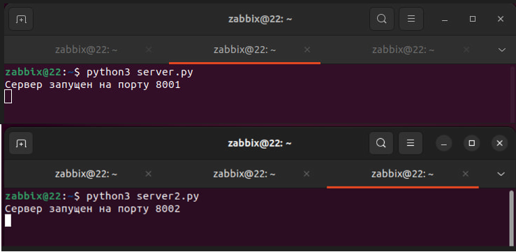

# Домашнее задание к занятию «Кластеризация и балансировка нагрузки» - Хомяков Антон.

### Цель задания
В результате выполнения этого задания вы научитесь:
1. Настраивать балансировку с помощью HAProxy
2. Настраивать связку HAProxy + Nginx

------

### Задание 1
- Запустите два simple python сервера на своей виртуальной машине на разных портах

- Установите и настройте HAProxy, воспользуйтесь материалами к лекции по [ссылке](2/)
- Настройте балансировку Round-robin на 4 уровне.
- На проверку направьте конфигурационный файл haproxy, скриншоты, где видно перенаправление запросов на разные серверы при обращении к HAProxy.

Конфигурация HAProxy: [haproxy-1.cfg](haproxy-1.cfg)

### Задание 2
- Запустите три simple python сервера на своей виртуальной машине на разных портах

- Настройте балансировку Weighted Round Robin на 7 уровне, чтобы первый сервер имел вес 2, второй - 3, а третий - 4
- HAproxy должен балансировать только тот http-трафик, который адресован домену example.local
- На проверку направьте конфигурационный файл haproxy, скриншоты, где видно перенаправление запросов на разные серверы при обращении к HAProxy c использованием домена example.local и без него.

Конфигурация HAProxy: [haproxy.cfg](haproxy.cfg)

---